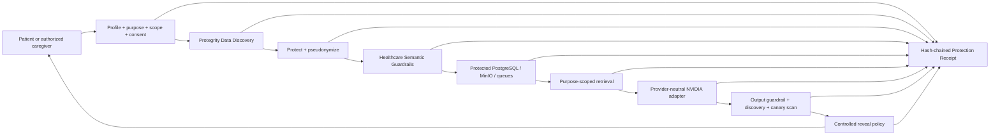

# Salus architecture

## Protected AI pipeline

The Privacy Gateway is the only component holding Protegrity credentials or calling unprotect. It disables SDK payload logging and records only trace IDs, timings, entity types, and counts. The API checks its readiness and fails closed when Protegrity cannot prove protection.

## Three controlled representations

| Representation | Content | Allowed destinations |
|---|---|---|
| Canonical protected envelope | Full value encrypted with a per-trace AES-256-GCM key; the data key is wrapped once by Protegrity and carried inside the versioned envelope | protected database columns only; Privacy Gateway unwraps after authorized reveal |
| AI-safe semantic view | deterministic pseudonyms plus purpose-minimized clinical facts | RLS database fields, chunks, vectors, scoped tools, provider payload |
| Evidence metadata | hashes, entity types/counts, decisions, durations, outcomes | Protection Receipts, Privacy Proof, audit exports |

“No identifier detected” is not treated as “no health data.” Full canonical clinical payloads remain protected even when classification finds no identifier; a separate view is deliberately minimized for clinical retrieval and reasoning.

One trace key is reused only inside the short-lived Privacy Gateway memory window for that trace, allowing input and output to share a cryptographic boundary without repeating hosted protection calls. Every persisted `SALUS1` envelope contains the Protegrity-wrapped key, a fresh nonce, and AES-GCM ciphertext. Web, API, workers, tools, and model adapters never receive the unwrapped key. A gateway restart requires Protegrity unprotect before an existing envelope can be revealed.

## Document boundary

Bytes enter transient API memory, are size/type checked and scanned by ClamAV, then encrypted with a per-object AES-256-GCM key. The key is wrapped by Protegrity before the ciphertext reaches MinIO. OCR/native extraction occurs in worker memory. Extracted text is sent to the Privacy Gateway before database writes, chunks, facts, embeddings, or NVIDIA calls. Raw audio is never sent to hosted speech services; local transcription or human review is required.

## Authorization layers

1. opaque server-side session and origin enforcement;
2. active Health Profile resolution;
3. valid consent and purpose grant;
4. requested scope and reveal-level check;
5. recent MFA for identifiers, original documents, and exports;
6. signed short-lived tool capability;
7. PostgreSQL row-level security as defense in depth;
8. output release policy and `no-store` controlled reveal.

Revocation is evaluated at every retrieval and tool boundary. Capabilities carry profile, actor, purpose, scopes, trace, issued time, and expiry; they cannot grant more authority than the active database grant.

## Failure semantics

- Protegrity discovery, protection, guardrail, postcondition, or key-wrap failure: block before write/provider call.
- malformed model JSON or non-allowlisted citation: reject response.
- output identifier/canary: replace with a protected block response and record the boundary.
- provider outage: deterministic healthcare functions remain available; AI returns an explicit availability error.
- revoked, expired, cross-profile, out-of-purpose, or insufficient-scope request: `403` before retrieval.
