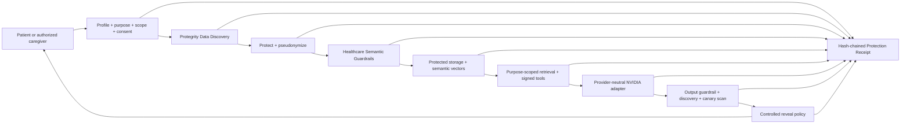

# Salus — Final Hackathon Submission

**Privacy-First Health AI for patients and authorized caregivers**

## GitHub repository

[github.com/shobhit1kapoor/Salus](https://github.com/shobhit1kapoor/Salus)

## Demo video

[Watch or download the 14-minute Salus technical demo](https://github.com/shobhit1kapoor/Salus/releases/download/submission-v1/salus-judge-demo.mp4)

The demonstration uses only synthetic healthcare data. It walks through the real application rather than a slide deck: the patient-first product experience, protected record ingestion, pseudonymized AI processing, purpose-limited caregiver sharing, controlled reveal and revocation, Privacy Proof, Attack Lab, and the reproducible Salus 80 validation result.

## Architecture overview

Salus is a patient-first healthcare AI system built around Protegrity as the first mandatory data boundary. Raw patient identifiers and unprotected sensitive values do not reach persistent storage, vector indexes, queues, model providers, agent tools, application logs, or telemetry. Necessary clinical facts can reach the AI only after authorization, purpose filtering, protection, pseudonymization, and minimum-necessary reduction.

The isolated Privacy Gateway is the only service holding Protegrity credentials or an unprotect capability. It performs discovery, protection, healthcare Semantic Guardrails, post-protection rescanning, and selective reveal. Salus fails closed before storage or model access if any required Protegrity stage cannot prove success.

Salus maintains three deliberate representations:

1. A canonical protected envelope containing AES-256-GCM ciphertext and a per-trace data key wrapped through Protegrity.
2. An AI-safe semantic view containing pseudonymized identifiers and only purpose-authorized clinical facts needed for retrieval and reasoning.
3. Evidence metadata containing hashes, entity types and counts, policy decisions, stage outcomes, destination scans, and timings—never original sensitive values.

Before an NVIDIA request, Salus assembles only authorized sources, replaces internal identifiers with ephemeral aliases, protects and rescans the complete prompt, and records the exact serialized payload's hash and byte count. After inference, it validates the response schema and citation allowlist, runs output Semantic Guardrails, Data Discovery, and prohibited-value canary checks, then applies controlled reveal policy. Every protected operation produces a hash-chained Protection Receipt visible in Privacy Proof.

Documents are malware-scanned and extracted in transient memory. File bytes are encrypted before MinIO, the object key is protected through Protegrity, canonical text is protected, and only the minimized semantic view may be chunked or embedded. Retrieval and tools use signed, short-lived capabilities bound to actor, profile, purpose, scope, trace, and expiry. Grant revocation is checked at every retrieval and tool boundary.

## Working implementation and evidence

- **Patient experience:** Health Profiles, Today, Timeline, Medications, Follow-ups, Records, Ask Salus, Sharing, and Privacy Proof.
- **Healthcare AI:** source-grounded answers, allowlisted citations, medication and follow-up intelligence, provider-neutral NVIDIA chat and embedding adapters, and deterministic clinical-safety controls.
- **Patient-controlled access:** purpose-based grants, scoped caregiver access, expiry and revocation, recent-MFA reveal, `Cache-Control: no-store`, and audited break-glass policy.
- **Verifiable privacy:** stage-by-stage Protection Receipts, destination scans, provider-payload hashes, leak/canary outcomes, guardrail decisions, append-only hash-chained audit history, and a 40-scenario Attack Lab.
- **Realistic infrastructure:** Next.js, Fastify, isolated Python Privacy Gateway, Protegrity Developer Edition, PostgreSQL/pgvector with row-level security, Redis/BullMQ, encrypted MinIO, ClamAV, Prometheus, and Docker Compose.
- **Acceptance result:** `npm run demo:preflight` passed every live readiness gate, and `npm run salus80` passed **80/80** care, safety, authorization, privacy-boundary, and adversarial scenarios on August 24, 2026.

## Reproduce the result

1. Configure `.env` from `.env.example` with Protegrity Developer Edition and NVIDIA credentials.
2. Run `docker compose up --build`.
3. Run `docker compose exec api npm run seed -w @salus/api`.
4. Run `npm run demo:preflight`.
5. Open [http://localhost:3000](http://localhost:3000).
6. Run `npm run salus80`.

The exact reviewer path is in the [Judge Quickstart](judge-quickstart.md). Detailed references: [architecture](architecture.md), [threat model](threat-model.md), [data-flow inventory](data-flow-inventory.md), [evidence methodology](evidence-methodology.md), and [limitations](limitations.md).

## Scope statement

Salus uses synthetic data for development and demonstration. It is a competitive prototype and makes no HIPAA, certification, clinical-validation, medical-device, or production-readiness claim.

